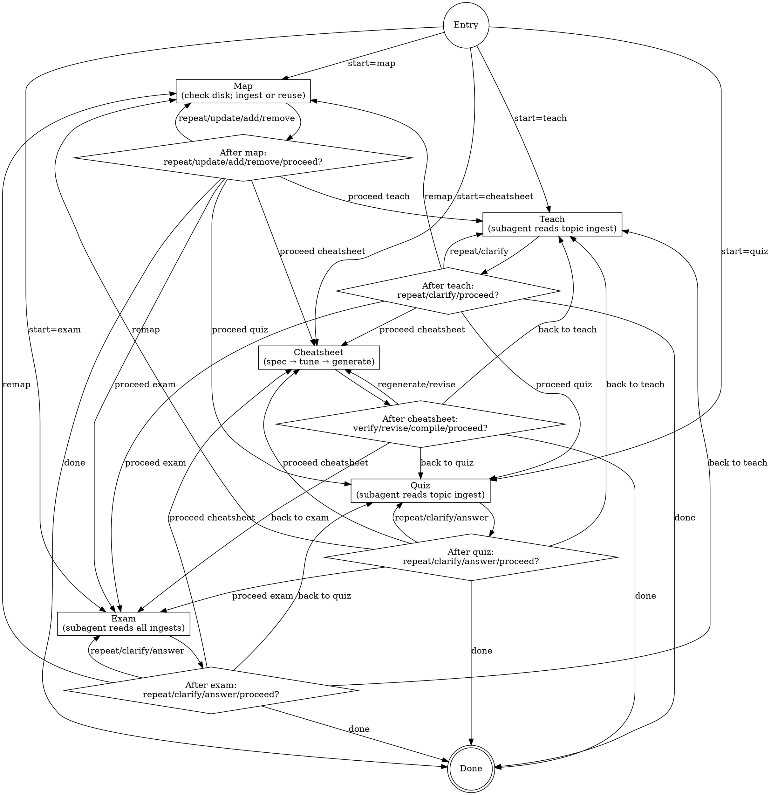

# Course Cram

Guide the user through four phases — **map** → **teach** → **quiz** → **exam** — with explicit transition prompts between every phase. The user controls every transition: post the prompt, wait, act on the choice. Never advance phases on your own.

<HARD-GATE>
- Never read ingest files in main context. (`<course-root>/.course-cram/ingests/*.md` except `INDEX.md` are subagent-only paths.) All reads/writes of ingest content are performed by subagents. Main agent may only `ls` the ingests directory and read `INDEX.md` and `session.md`.
- Never ingest source materials (lecture PDFs, tutorial PDFs, past-paper PDFs, etc.) in main context. Source reading is done exclusively by subagents, which write transcription directly to `<course-root>/.course-cram/ingests/<topic>.md`.
- Never drop information during ingest. Ingest-writing subagent prompts include the literal "no information loss" clause from `CONTEXT.md`; subagent-written transcription must be complete. Rephrasing for density (tables, dense bullets, verbatim markdown) is permitted; summarization, paraphrase, or omission is not.
- Never write to disk outside `<course-root>/.course-cram/`. Source materials are read-only.
- Never invent content beyond what the ingests support. If a requested topic has no ingest, extend the map first — do not guess.
- Never reveal quiz or exam answers until the user explicitly requests them in the post-step prompt.
- Never skip a phase or chain phases automatically. Each transition requires an explicit user selection from the posted menu.
- Never reuse the user's past answers as "correct" — answer keys derive from the ingests (source materials), not from the user's attempts.
- Never include cheatsheet content not present in the in-scope ingests. SCOPE GAP is the only acceptable response to a missing item.
- Never write `.tex` files outside `<course-root>/.course-cram/cheatsheets/`.
- Never auto-compile the cheatsheet. Compilation runs only on explicit user request from the post-Cheatsheet menu.
- Never embed lecture-slide text as filler. Every line in the cheatsheet output is traceable to the ingest.
- Never emit a cheatsheet content block without a `% src: <slug>.md p<N>` provenance comment. The generation subagent's manifest must report 100% provenance coverage; a lower number means the manifest is rejected and generation re-dispatched.
- Never let the Verify subagent read whole ingest files. It reads only the page ranges named in the cheatsheet's provenance comments — that is the entire purpose of the comments.
</HARD-GATE>

## Checklist

Use TodoWrite to track one task per phase invocation. Complete in order:

1. **Pre-entry check** — check for `<cwd>/.course-cram/session.md`; offer resume if found
2. **Entry prompt** — ask which phase to start from
3. **Execute selected phase** (map / teach / quiz / exam)
4. **Post-phase transition prompt** — user picks next action
5. **Loop to step 3** (execute next phase) or exit when user says done

## Process Flow



## Context Management

Course materials at full fidelity project to hundreds of thousands of tokens — too much for the main conversation. This skill solves that with **persistent, subagent-owned, topic-split ingests on disk**.

### 1. Ingests live at `<course-root>/.course-cram/ingests/`

- One `.md` file per topic (e.g. `week-03-portfolio-theory.md`), written by a subagent during Map.
- `INDEX.md` inside the same directory holds topic-level metadata only (source files, page counts, timestamps, flags). The main agent may read `INDEX.md` — it is metadata, not transcription.
- Source PDFs and text files are read **only** by subagents. Main agent never opens them.

### 2. Main agent never reads ingest content

Every content-bearing operation dispatches a subagent that reads the relevant ingest file(s), generates the output within budget, and returns only the rendered response. Main agent footprint stays: `INDEX.md` summary + session state + current rendered response.

| Operation | Subagent type | What subagent does |
|---|---|---|
| Map — ingest write | general-purpose | reads source files, writes `<topic>.md`, returns manifest only |
| Teach | Explore | reads `<topic>.md`, returns rendered teach content |
| Quiz generation | Explore | reads `<topic>.md`, returns questions only |
| Quiz marking | Explore | reads `<topic>.md` + receives user answers, returns marked key |
| Exam format inference | Explore | reads past-paper ingest(s), returns format spec |
| Exam generation | Explore | reads ingest(s) + spec, returns exam paper |
| Exam marking | Explore | reads ingest(s) + receives user answers, returns worked solutions |

### 3. Topic split

Map groups source files by topic (default: one topic per unit). One general-purpose subagent per topic writes one `.md` file. Updates are per-topic — re-transcribe one topic without touching others.

### 4. Output budgets (display-only; ingest stays complete on disk)

| Output | Cap |
|---|---|
| Scope-confirmation (pre-map) | ≤ 150 words |
| Map manifest (post-map prompt) | ≤ 400 words, strict template |
| Teach — Recap | ≤ 500 words |
| Teach — Review | ≤ 1500 words |
| Teach — Full re-teach | ≤ 3500 words (subagent splits; asks "continue?" if longer) |
| Teach — Subtopic deep-dive | ≤ 2000 words |
| Quiz presentation | numbered Qs only, no preamble |
| Quiz answer key | ≤ 80 words per question |
| Exam presentation | paper format only, no preamble |
| Exam answer key | ≤ 150 words per long Q, ≤ 60 words per MCQ |
| Post-step menus | exact numbered lists, no elaboration |

Budgets constrain the subagent's returned rendered response, not the ingest. The ingest on disk is always the complete transcription.

### Sidecar reference

**Read `CONTEXT.md` (in this skill directory) before dispatching any subagent.** It holds exact prompt templates (including the no-loss clause wording that must appear verbatim in ingest-write prompts), `INDEX.md` and `session.md` schemas, topic-grouping heuristics, and the output-budget table.

## Entry

### Pre-entry check

On invocation, run `ls <cwd>/.course-cram/session.md 2>/dev/null` via Bash. If present, read it and offer:

> **Previous session found** (updated `<timestamp>`). Last phase: `<phase>`. Topics mapped: `<N>`. Weak areas: `<list or "none">`.
> 1. **Resume** — jump to the phase you left off (ingests already on disk; no re-map needed)
> 2. **Start fresh** — ignore the snapshot, run normal Entry prompt
> 3. **View snapshot** — display `session.md`, then re-prompt

If no `session.md`, post the normal Entry prompt.

### Normal Entry prompt

> **Course Cram ready.** Where would you like to start?
> 1. **Map** — check/build topic ingests on disk
> 2. **Teach** — explain topic(s) (requires prior map or explicit scope)
> 3. **Quiz** — short scoped quiz (requires prior map or explicit scope)
> 4. **Exam** — comprehensive mock (requires prior map or explicit scope)
> 5. **Cheatsheet** — generate a LaTeX (.tex) cheatsheet from the mapped ingests
>
> Reply with a number or phase name.

If the user picks Teach (2), Quiz (3), or Exam (4):

1. Run `ls <cwd>/.course-cram/ingests/INDEX.md 2>/dev/null` via Bash.
2. **INDEX.md found** — read it (metadata only). Proceed directly to the selected phase using the mapped topics as the default scope. Do not ask about the map.
3. **INDEX.md not found** — post:

   > No map found at `<cwd>/.course-cram/ingests/`. The Map phase must be completed before topics can be loaded.
   > 1. **Run Map now** — go to Phase 1 (Map)
   > 2. **Provide explicit scope** — describe your course materials here; I will teach/quiz/examine based on what you provide without persisted ingests
   > 3. **Cancel** — return to Entry

## Phase 1 — Map

### Step 0 — Disk check

Run `ls <course-root>/.course-cram/ingests/ 2>/dev/null` via Bash. If the user hasn't specified a course-root, offer the current working directory as default.

#### Branch A — No ingests found (dir missing or empty)

Post:

> No ingest found at `<course-root>/.course-cram/ingests/`. Begin ingestion?
> 1. **Begin ingest** — specify scope, dispatch subagents to transcribe
> 2. **Change root** — specify a different course-root path
> 3. **Cancel** — return to Entry

On "Begin ingest": proceed to Step 1.

#### Branch B — Ingests found

Read `<course-root>/.course-cram/ingests/INDEX.md` (main-agent-safe; metadata only). Post:

> Found `<N>` topic ingests at `<path>` (last updated `<most-recent-date>`):
> - `<topic-label>` (`<source-file-count>` files, `<pages>` pages, updated `<date>`)
> - `<topic-label>` ...
>
> What next?
> 1. **Use existing** — skip ingest; mark map ready and proceed to post-map menu
> 2. **Update one topic** — pick a topic; re-dispatch its ingest subagent
> 3. **Update all** — re-dispatch subagents for every topic
> 4. **Add new topic** — specify new source files + topic label; dispatch one subagent
> 5. **Remove a topic** — pick a topic; delete its `.md` + INDEX entry (no subagent needed)
> 6. **Cancel**

Handle the chosen option, then proceed to Step 3 (post-map manifest).

### Step 1 — Enumerate & propose topic grouping

(Only runs when ingesting or adding topics.)

1. Use Glob/LS to enumerate matched files under the course-root for the user's scope.
2. Run batched `pdfinfo` in a single Bash call for all PDF page counts (metadata only — safe for main context).
3. Classify files by category (from directory names and filename patterns: `lecture slides/`, `tutorial/`, `midterm test/`, `final exam/`, etc.).
4. Propose topic grouping: default is one topic per unit (e.g., one slug per week), inferred from filename patterns (`Week N`, `Tutorial N`, `Lecture N`, `Topic N`). Cross-unit materials get dedicated slugs (`past-papers-midterm`, `past-papers-final`, `admin`).
5. Generate a slug for each topic: lowercase, hyphen-separated, ≤ 40 chars.
6. Post scope + grouping confirmation (≤ 150 words):

> About to ingest `<N>` files (~`<P>` total pages) into `<K>` topic ingests:
> - `<topic-slug-1>.md` ← `<file list>` (`<pages>` pages)
> - `<topic-slug-2>.md` ← ...
>
> Reply **go** to proceed, **regroup** to adjust topics, or **stop** to narrow scope first.

### Step 2 — Dispatch ingest subagents (parallel)

One subagent per topic. **Read `CONTEXT.md` first**, then launch all in a **single message with multiple Agent tool calls** (parallel).

Each subagent is **general-purpose** type (needs Write access). The prompt uses the **Ingest write template** from `CONTEXT.md`. Every ingest-write prompt must include:

- Topic slug and target ingest file path: `<course-root>/.course-cram/ingests/<slug>.md`
- Full list of source files assigned to this topic
- Instruction to create `<course-root>/.course-cram/ingests/` via `mkdir -p` before writing
- Instruction to write the transcription to the target path via the Write tool
- The **literal no-loss clause** copied verbatim from `CONTEXT.md`
- Return contract: manifest only (`{ingest_path, source_files, total_pages, flags}`) — no transcription content in the return message

The subagent reads each assigned source file in full (using Read tool's `pages` argument for PDFs > 10 pages), then writes the complete transcription as a single Write to `<slug>.md`.

### Step 3 — Main agent writes `INDEX.md`

After all subagents return, main agent composes `<course-root>/.course-cram/ingests/INDEX.md` from the returned manifests. Format: see `CONTEXT.md` → "INDEX.md schema".

### Step 4 — Post-map manifest

Post (≤ 400 words, strict template):

> **Map complete.** `<K>` topic ingests at `<course-root>/.course-cram/ingests/`:
> - `<topic-slug-1>.md` — `<source files>` (`<pages>` pages)
> - `<topic-slug-2>.md` — ...
>
> Subagent-flagged content: `<illegible/ambiguous items from manifests, or "none">`.
>
> What next?
> 1. **Repeat** the map (re-dispatch subagents for every topic)
> 2. **Update** scope (re-enter Step 0 Branch B)
> 3. **Add** materials (new topic or new files into an existing topic)
> 4. **Remove** materials (delete a topic ingest)
> 5. **Proceed to Teach**
> 6. **Proceed to Quiz**
> 7. **Proceed to Exam**
> 8. **Proceed to Cheatsheet**
> 9. **Done**
> 10. **Snapshot & exit** — append session state to `<course-root>/.course-cram/session.md` and end

Do not add extra commentary, encouragement, or unsolicited suggestions.

## Phase 2 — Teach

### Input (prompt the user for)

- **Target topic(s)** — must match a slug in `INDEX.md` (main agent reads `INDEX.md` to validate and list options). If no prior map, ask the user for scope explicitly.
- **Detail level** (offer as a numbered choice):
  1. **Full re-teach** — from first principles, derivations, worked examples, common pitfalls
  2. **Review** — mid-depth recap with key concepts, formulas, representative examples
  3. **Recap** — high-level summary, 5-10 key takeaways
  4. **Subtopic deep-dive** — user names a specific subtopic; teach only that

### Execute

Read `CONTEXT.md` → "Teach template". Dispatch a **Teach subagent** (Explore type). Prompt includes:

- Path(s) to the relevant `<topic>.md` ingest file(s)
- Detail level + word budget (Recap 500 / Review 1500 / Full 3500 / Subtopic 2000)
- Rules: pull content exclusively from the ingests; cite as `<source-filename>, page <N>` using `## Page <N>` markers in the ingest; use worked examples from tutorial-solution sections in the ingest where relevant; if a topic has no ingest coverage, return `[SCOPE GAP: <topic>]` only — do not invent
- For Full re-teach expected to exceed 3500 words: end the first part at a natural stopping point with `— continue? (reply yes for next part)`; do NOT auto-continue

Main agent posts the returned content verbatim, then posts the post-teach menu.

Remember the **teach scope** — the next quiz defaults to it.

### Exit — Post-Teach Prompt

> **Teach complete on `<topic(s)>` at `<detail level>`.** What next?
> 1. **Repeat** this teach (same scope, same level)
> 2. **Clarify** — you have questions about what was taught
> 3. **Proceed to Quiz** (uses this teach scope)
> 4. **Proceed to Exam**
> 5. **Proceed to Cheatsheet**
> 6. **Back to Teach** (different topic or level)
> 7. **Back to Map**
> 8. **Done**
> 9. **Snapshot & exit**

## Phase 3 — Quiz

### Input

Uses the **last teach scope** by default. If no prior teach, prompt the user for scope.

### Execute — Question generation

Read `CONTEXT.md` → "Quiz generation template". Dispatch **Quiz-generation subagent** (Explore type). Prompt includes:

- Path(s) to relevant `<topic>.md` ingest file(s)
- "Generate 5-8 questions covering the scope. Mix: conceptual short-answer, numerical (if the course is quantitative), formula application/interpretation. Present all questions at once: first line `**<topic> Quiz — Total: <M> marks**`, then questions numbered with marks bracketed at end of each. No preamble. No commentary. No answers."

Main agent posts the returned questions verbatim and waits for the user's attempt (or "skip to answers").

### Execute — Marking (on "Show answers")

Read `CONTEXT.md` → "Quiz marking template". Dispatch **Quiz-marking subagent** (Explore type). Prompt includes:

- Path(s) to the same ingest file(s)
- The questions (copied from the generated quiz)
- The user's answers
- "Return a per-question answer key: (a) the answer, (b) a 1-sentence justification citing `<source-filename>, page <N>`, (c) the marking point. Budget: ≤ 80 words per question. Compute and return score `<X>/<total>`."

Main agent posts the returned answer key verbatim.

### Exit — Post-Quiz Prompt

> **Quiz done.** What next?
> 1. **Repeat** quiz (fresh questions, same scope)
> 2. **Clarify** — ask about a specific question
> 3. **Show answers** — reveal answer key with explanations and mark the attempt
> 4. **Proceed to Exam**
> 5. **Proceed to Cheatsheet**
> 6. **Back to Teach**
> 7. **Done**
> 8. **Snapshot & exit**

## Phase 4 — Exam

### Input (prompt the user for)

- **Exam type** — Midterm / Final / user-named
- **Scope** — defaults to all topics in `INDEX.md`; user may narrow

### Execute — Step 1: Format inference

Read `CONTEXT.md` → "Format inference template". Dispatch **Format-inference subagent** (Explore type). Prompt includes:

- Path(s) to past-paper ingest file(s) (e.g., `past-papers-midterm.md`, `past-papers-final.md`)
- "Return a complete structured format spec: total question count, type breakdown (MCQ/short/long/numerical counts), marks per question (list every value) and paper total, time limit verbatim, section structure (every section label + question range), representative question phrasings verbatim (≥ 2-3 per type), cover-page instructions verbatim, allowed materials verbatim, rubric text verbatim. Dense tables and bullets. No summarization."
- No-loss clause applies (verbatim elements must appear verbatim)

Main agent records the returned spec in context (bounded; it is format metadata, not transcription).

If no past-paper ingests exist for the requested exam type: prompt user to proceed with generic format or abort.

### Execute — Step 2: Exam generation

Read `CONTEXT.md` → "Exam generation template". Dispatch **Exam-generation subagent** (Explore type). Prompt includes:

- Path(s) to all topic ingest files for the exam scope
- The format spec from Step 1
- Mix strategy: ~30% **anchor questions** — lifted verbatim from past-paper ingest content, each labeled `[<paper-reference>, Q<N>]`; ~70% **new questions** — matching inferred format, difficulty, and marks distribution, covering the full scope
- Output: single structured paper (title header, instructions, section breakdown, numbered questions, marks per question, simulated time limit). No answers. No preamble.

Main agent posts the returned paper verbatim and waits.

### Execute — Step 3: Marking (on "Show answers")

Read `CONTEXT.md` → "Exam marking template". Dispatch **Exam-marking subagent** (Explore type). Prompt includes:

- Path(s) to the topic ingest files used in generation
- The exam paper
- The user's answers
- The format spec
- "Return: full worked solution for every question, mark the user's attempt, performance summary by topic, 2-3 topics most worth re-teaching. Budget: ≤ 150 words per long question, ≤ 60 words per MCQ."

Main agent posts the returned solutions verbatim. If a snapshot is in progress, update the cumulative weak-area list in `session.md`.

### Exit — Post-Exam Prompt

> **Exam submitted.** What next?
> 1. **Repeat** exam (fresh paper, same scope)
> 2. **Clarify** — ask about a specific question
> 3. **Show answers** — full worked solutions, mark the attempt, identify weak areas
> 4. **Back to Teach** (target identified weak areas)
> 5. **Back to Quiz**
> 6. **Back to Map**
> 7. **Proceed to Cheatsheet**
> 8. **Done**
> 9. **Snapshot & exit**

## Phase 5 — Cheatsheet

Produces a fully self-contained LaTeX (`.tex`) cheatsheet file whose content is drawn exclusively from the mapped ingests. Requires a prior map (same precondition as Teach/Quiz/Exam). If `INDEX.md` is not found, redirect to Map first.

### Step 1 — Spec discovery

Dispatch a **Cheatsheet-spec-inference subagent** (Explore type). Read `CONTEXT.md` → "Template 8". Pass whichever of `past-papers-midterm.md` / `past-papers-final.md` exist in `INDEX.md`. The subagent returns:

- `observed_constraints`: each rule quoted verbatim with `<paper-ref, page N>` citation (media size, sheet count, sides, font floor, typeset vs handwritten, any other restrictions)
- `recommended_defaults`: concrete values satisfying every constraint

If no rules found, returns `[NO CONSTRAINTS OBSERVED]`.

Main agent posts the returned block verbatim before proceeding.

### Step 2 — Spec confirmation

Main agent posts a numbered specification form, pre-populated with `recommended_defaults` from Step 1 (or library defaults if none observed):

| Field | Library default | If constraints observed |
|---|---|---|
| Paper size | `A4` | from rules |
| Orientation | `landscape` | `landscape` (always) |
| Sides | `2` | from rules (clamped to rule maximum) |
| Sheet count | `1` | from rules (clamped) |
| Columns per side | `3` | `3` |
| Font size | `[8pt, 10pt]` range | floor from rules (locked min); user picks max |
| Detail level | `2 — Standard` | same |
| Topic scope | every slug in `INDEX.md` | same |
| Section ordering | by lecture order | same |
| Output filename | `cheatsheet-<scope>-<YYYYMMDD>.tex` | same |

**Font size as a range.** Accept either a single value (`8pt`) or a closed range (`[8pt, 10pt]`). The lower bound is clamped to the past-paper rule floor; user cannot go below it. Step 3 chooses the final size automatically within the range.

**Detail levels** (numbered choice in the form):
1. **Skeleton** — formulas and definitions only; no prose; densest.
2. **Standard** — formulas, definitions, 1-line worked steps, one-line "when to use" per technique.
3. **Detailed** — Standard + boxed mini-examples lifted from tutorial-solution sections of the ingest.

Hard rule stated in the form: _content sourced exclusively from ingests; user must request "supplement" mode explicitly to allow extra-ingest additions._

User replies with overrides or `go` to accept defaults. Capture the accepted spec in main-agent context.

### Step 3 — Page-fit estimate + font auto-tune

Read `CONTEXT.md` → "Template 8.5". Dispatch a **Cheatsheet-fit subagent** (Explore type) with:

- In-scope ingest paths
- Paper/orientation/sides/sheet/columns from spec
- Font-size range from spec
- Detail tier

The subagent reads each ingest **structurally** (section/subsection counts, formula counts, sampled block lengths — not full verbatim content) and sweeps candidate font sizes across the range (1 pt granularity). For each, it computes capacity vs estimated content size, predicted overflow %, and predicted last-column fill %. It returns a per-size table and a recommended font — the **largest size in the range** satisfying `predicted_overflow == 0 ∧ predicted_last_col_fill ≥ 5/6` (≈ 83.3%).

Main agent posts the table verbatim and the recommendation.

If no font in the range satisfies both constraints, post the trade-off prompt:

> No font size in `[<min>, <max>]` satisfies both fit and ≥ 5/6 last-column fill.
> 1. **Lower the floor** (rule floor: `<rule_floor>`)
> 2. **Drop a topic** from scope
> 3. **Drop the detail tier** (current: `<tier>`)
> 4. **Accept under-fill** at `<largest-fitting>pt` (last-col ~`<pct>%`)
> 5. **Accept overflow** at `<min+1>pt` (~`<pct>%`)
> 6. **Cancel**

Handle the chosen option, then confirm the locked font size. This size is final and stored in the spec snapshot.

### Step 4 — Generate

Read `CONTEXT.md` → "Template 9". Dispatch a **Cheatsheet-generation subagent** (general-purpose type — needs Write). Prompt includes:

- Full list of in-scope ingest paths
- Finalised spec (paper, orientation, sides, columns, font_chosen, detail, ordering, filename)
- Target path: `<course-root>/.course-cram/cheatsheets/<filename>.tex`
- Template 9 preamble block (`extarticle`, `multicol`, `geometry`, `amsmath`, `amssymb`) with values plugged from spec
- Per-item provenance requirement: above every formula, definition, theorem, algorithm step, and worked-example fragment, emit `% src: <slug>.md p<N>` (narrowest single page when possible; range `p<A-B>` only when item genuinely spans pages). Section-level `% section-src: <slug>.md` comments are required in addition.
- Trim priority if content exceeds column budget: (1) full prose paragraphs, (2) verbal restatements of formulas, (3) derivations, (4) secondary worked examples. Never invent to fill space.
- No-loss-inverse clause (from Template 9 — copy verbatim).
- Return contract: manifest only `{tex_path, sections_written, sections_dropped_for_fit, scope_gaps, provenance_coverage_pct}`.

Main agent checks `provenance_coverage_pct` in the returned manifest. If `< 100`, re-dispatch with an explicit error note. On 100%, write/update `cheatsheets/INDEX.md` with a new row (spec snapshot including both `font_range` and `font_chosen`, scope gaps, last-col fill estimate, timestamp). Run `mkdir -p <course-root>/.course-cram/cheatsheets` before the first write.

Post the summary: `tex_path`, scope gaps, sections dropped for fit (if any), `\documentclass` line quoted to confirm spec.

### Step 5 — Post-Cheatsheet menu

```
Cheatsheet written to <tex_path>. What next?
1. Verify            — fact-check the cheatsheet against the cited ingest ranges
2. Compile           — run pdflatex; report errors and final page count
3. Revise section    — pick a section; subagent re-emits only that section
4. Trim              — drop a topic or lower detail tier; regenerate
5. Expand            — add a topic or raise detail tier; regenerate (subject to fit)
6. Regenerate        — fresh sheet with same spec (re-runs Steps 3–4)
7. New cheatsheet    — back to Step 1 with fresh spec
8. Back to Teach
9. Back to Quiz
10. Back to Exam
11. Done
12. Snapshot & exit
```

#### Option 1 — Verify

Main agent asks for verification scope:

```
Verify scope?
1. Whole sheet        — every item in the .tex
2. One section        — pick a section heading
3. Specific items     — paste line numbers or a regex
4. Cancel
```

On scope selection:
1. Main agent reads the `.tex` file (small, main-agent-safe).
2. Parses every `% src: <slug>.md p<N>` comment within scope into a `(slug, page-range, content-block)` table.
3. Coalesces by slug+page-range so each unique range is read once.
4. Read `CONTEXT.md` → "Template 12". Dispatch one **Cheatsheet-verify subagent** (Explore type) per slug in parallel. Prompt: ingest path, exact page ranges to read, list of content blocks claimed against each range. The subagent reads only those ranges using `### Page <N>` markers — not the full ingest.
5. Aggregate results: for each block, one of `MATCH` / `MISMATCH` (with side-by-side excerpt) / `MISSING` / `OUT_OF_RANGE`.
6. Post summary: `<matched>/<total>` with every non-MATCH listed and a one-line proposed action.

Verify is read-only. To fix a discrepancy, user picks option 3 (Revise section) which receives the discrepancy as context.

#### Option 2 — Compile

Run `pdflatex -interaction=nonstopmode -halt-on-error <tex_path>` via Bash from `<course-root>/.course-cram/cheatsheets/`. On error, surface the first error block and offer to dispatch a **Cheatsheet-fix subagent** (Explore, `CONTEXT.md` → "Template 11"). On success, report `<N> pages` and warn if N exceeds spec's allowed page count.

If `pdflatex` is not installed, post: "pdflatex not found — install TeX Live or MiKTeX to use this option."

#### Option 3 — Revise section

Read `CONTEXT.md` → "Template 10". Dispatch a **Cheatsheet-revision subagent** (general-purpose type). Reads existing `.tex` + relevant ingest(s); regenerates only the named section in place; preserves and updates per-item provenance comments; returns diff. Same no-loss-inverse clause applies.

---

## Snapshot & Resume

Two kinds of persistent state under `<course-root>/.course-cram/`:

| Path | Owner | Content |
|---|---|---|
| `ingests/<topic>.md` | general-purpose subagents (ingest write) | complete per-topic transcription |
| `ingests/INDEX.md` | main agent | topic metadata (source files, pages, timestamps, flags) |
| `session.md` | main agent | session state (map log, teach/quiz/exam logs, weak-area list) |

Ingests persist automatically across sessions. `session.md` is append-only; the pre-entry check reads it to offer resume.

### When to write `session.md`

- User picks **Snapshot & exit** from any post-step menu
- Before a long exam attempt (insurance against context compaction)
- User says "save progress" / "I'll continue later"

### Schema

See `CONTEXT.md` → "session.md schema".

### Resume flow

1. Pre-entry check reads `session.md`, offers resume
2. On resume: run `ls <course-root>/.course-cram/ingests/` and read `INDEX.md` to confirm topics present
3. If any topic ingest is missing: prompt the user to re-ingest that topic
4. Otherwise: jump to the last-active phase — no re-map needed

## Key Principles

- **User-driven transitions only.** Post the prompt, wait, act on the choice. No auto-chaining.
- **Subagents own ingest I/O.** Main agent sees metadata and rendered outputs only.
- **Ingests persist across sessions.** Map once; reuse forever until materials change.
- **Answer keys gated.** Revealed only when the user explicitly asks via the post-step menu.
- **Cite sources.** Subagents cite `<source-filename>, page <N>` using ingest page markers.

## Gotchas

- **Subagent type for writes**: Explore subagents lack Write access. Always use **general-purpose** type for ingest-write subagents. Explore is fine for all read-only subagents (teach/quiz/exam).
- **Large PDFs**: Read tool errors on PDFs > 10 pages without the `pages` argument. Ingest-write subagent prompts must explicitly instruct paging through (`pages: "1-10"`, `pages: "11-20"`, …). Do not skip tail pages.
- **Image-heavy slides**: lecture slides often carry 50%+ of content in charts, payoff diagrams, tables, and equation graphics. A PDF that parses to little text is NOT empty — the ingest-write subagent must visually render and transcribe every examinable element per the non-text rules in `CONTEXT.md`.
- **Equation fidelity**: never paraphrase a formula. The no-loss clause requires original variable names and structure. Paraphrased formulas produce wrong quiz/exam answers.
- **mkdir**: the ingest directory `<course-root>/.course-cram/ingests/` must exist before writing. Ingest-write subagent prompts include a `mkdir -p` instruction. If the main agent initiates a partial re-ingest, the directory already exists — no harm in re-running mkdir.
- **Anchor question labeling**: the exam-generation subagent must label every past-paper anchor with its source (paper reference + original question number as found in the ingest content).
- **No past papers in ingest**: if the requested exam type has no past-paper ingest, ask whether to proceed with a generic format or abort.
- **Scope gaps**: if a subagent returns `[SCOPE GAP: <topic>]`, main agent must not invent content. Offer to extend the map for that topic first.
- **Tutorial solutions as answer source**: when quiz/exam marking subagents derive answers, prefer the reasoning style and notation from tutorial-solution sections in the ingests over general knowledge.
- **Filename collisions in `cheatsheets/INDEX.md`**: if `<filename>.tex` already exists in the cheatsheets dir, the generation subagent overwrites it (same path = intentional update). Main agent must update the existing `INDEX.md` row rather than appending a duplicate. Detect collisions by matching filename before dispatching.
- **pdflatex missing**: if `which pdflatex` returns non-zero, do not error silently — post the "pdflatex not found" message and offer the Compile option only from the menu (not as a hard failure). The `.tex` file is still the primary deliverable.
- **Spec drift across revisions**: after every successful Revise-section or Regenerate, re-snapshot the current spec into the `cheatsheets/INDEX.md` row (especially `font_chosen`, `sections_dropped_for_fit`, `scope_gaps`). A stale snapshot makes future re-generates unpredictable.
